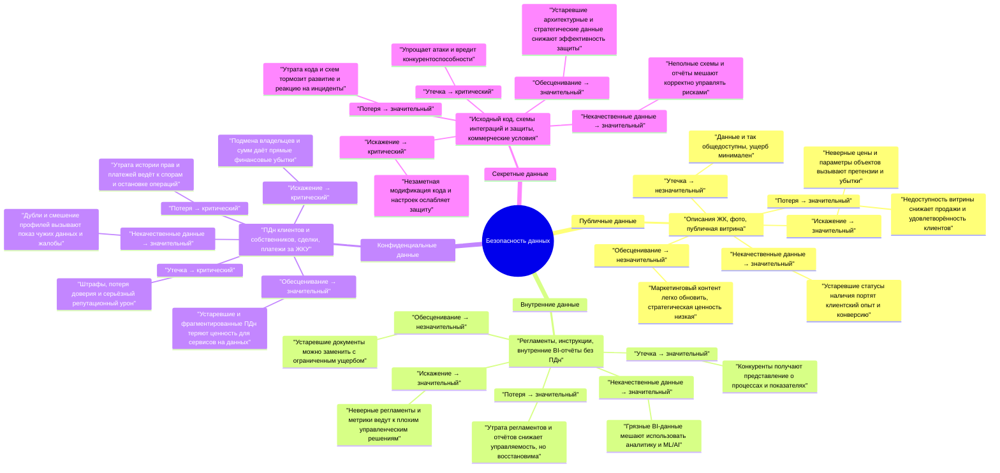

# Задание 1. Разработка проверочного листа по безопасности данных

Первым делом нужно разработать проверочный лист по безопасности данных. Сейчас это ключевая проблема компании и самое уязвимое место. Чтобы создать документ, выполните четыре шага.

## 1. Проанализируйте диаграмму и описание системы PropDevelopment.

Классифицируйте данные, с которыми работает компания, по стандартам ISO/IEC 27001 и 27002. Распределите их по 4 категориям:

* публичные данные,
* внутренние данные,
* конфиденциальные данные,
* секретные данные.

| Данные / Категория                           | Публичные | Внутренние | Конфиденциальные | Секретные |
|:---------------------------------------------|:----------|:-----------|:-----------------|:----------|
| Описания ЖК, фото, 3D‑туры без ПДн           | ✓         |            |                  |           |
| Публичная витрина недвижимости фонта         | ✓         |            |                  |           |
| Внутренние регламенты и инструкции           |           | ✓          |                  |           |
| Внутренние BI‑отчёты без ПДн (агрегаты)      |           | ✓          |                  |           |
| ПДн клиентов и собственников                 |           |            | ✓                |           |
| История бронирований и онлайн‑сделок         |           |            | ✓                |           |
| Платежи за ЖКУ, начисления, реквизиты        |           |            | ✓                |           |
| Исходный код ключевых приложений             |           |            |                  | ✓         |
| Детальные схемы интеграций и защиты          |           |            |                  | ✓         |
| Договоры и коммерческие условия с партнёрами |           |            |                  | ✓         |

## 2. Определите риски для каждой категории данных.

В каждой категории данных могут существовать следующие риски:

* утечка данных,
* потеря данных,
* искажение данных,
* некачественные данные,
* обесценивание данных.

| Данные / Риск                                | Утечка | Потеря | Искажение | Некачественные данные | Обесценивание |
|:---------------------------------------------|:-------|:-------|:----------|:----------------------|:--------------|
| Описания ЖК, фото, 3D‑туры без ПДн           |        | ✓      | ✓         | ✓                     | ✓             |
| Публичная витрина недвижимости фонта         |       | ✓      | ✓         | ✓                     | ✓             |
| Внутренние регламенты и инструкции           | ✓      | ✓      | ✓         | ✓                     | ✓             |
| Внутренние BI‑отчёты без ПДн (агрегаты)      | ✓      | ✓      | ✓         | ✓                     | ✓             |
| ПДн клиентов и собственников                 | ✓      | ✓      | ✓         | ✓                     | ✓             |
| История бронирований и онлайн‑сделок         | ✓      | ✓      | ✓         | ✓                     | ✓             |
| Платежи за ЖКУ, начисления, реквизиты        | ✓      | ✓      | ✓         | ✓                     | ✓             |
| Исходный код ключевых приложений             | ✓      | ✓      | ✓         | ✓                     | ✓             |
| Детальные схемы интеграций и защиты          | ✓      | ✓      | ✓         | ✓                     | ✓             |
| Договоры и коммерческие условия с партнёрами | ✓      | ✓      | ✓         | ✓                     | ✓             |

## 3. Объясните, почему именно этот риск актуален для указанной категории данных.

**Публичные данные**

- Утечка — незначительный: информация и так предназначена для общего доступа, ущерб минимален.
- Потеря — значительный: недоступность витрины снижает продажи и NPS, создаёт простой каналов продаж.
- Искажение — значительный: неверные цены/характеристики вызывают претензии и финансовые потери.
- Некачественные данные — значительный: устаревшие остатки и статусы объектов портят клиентский опыт.
- Обесценивание — незначительный: маркетинговый контент можно быстро пересоздать, стратегическая ценность мала.

**Внутренние данные**

- Утечка — значительный: конкуренты получают знания о процессах и показателях, но без ПДн эффект ограничен.
- Потеря — значительный: утрата регламентов/отчётов снижает управляемость, но возможна реконструкция.
- Искажение — значительный: некорректные регламенты и BI вызывают неправильные управленческие решения.
- Некачественные данные — значительный: «грязные» агрегаты ломают дата‑драйвен‑решения и мешают запуску ML/AI.
- Обесценивание — незначительный: устаревшие регламенты/отчёты просто заменяют новыми, ущерб ограничен.

**Конфиденциальные данные (ПДн, сделки, платежи)**

- Утечка — критический: нарушение законов о ПДн, штрафы, искажение доверия и репутационный урон.
- Потеря — критический: утрата истории прав собственности/платежей ведёт к юридическим спорам и остановке бизнес‑процессов.
- Искажение — критический: подмена владельца, сумм и реквизитов даёт прямой финансовый ущерб и суды.
- Некачественные данные — значительный: дубли и пересечения профилей вызывают вывод чужих данных в ЛК, жалобы и рост рисков утечки.
- Обесценивание — значительный: устаревшие и фрагментированные клиентские данные теряют ценность для аналитики и персонализации.

**Секретные данные (код, схемы, партнёрские условия)**

- Утечка — критический: упрощает атаки, раскрывает уязвимости и коммерческие условия, бьёт по конкурентоспособности.
- Потеря — значительный: утрата кода/схем замедляет развитие и реагирование на инциденты, но с бэкапами обратима.
- Искажение — критический: незаметная модификация кода и конфигураций безопасности напрямую снижает уровень защиты.
- Некачественные данные — значительный: неполные схемы/отчёты мешают корректно управлять рисками и выполнять ISO‑требования.
- Обесценивание — значительный: устаревшие планы и архитектура снижают эффективность защиты и инвестиций в ИБ.

## 4. Дайте оценку каждому риску.

В качестве шкалы используйте категории «незначительный-значительный-критический».

| Категория / Риск                         | Незначительный | Значительный | Критический |
|:-----------------------------------------|:---------------|:-------------|:------------|
| Публичные – утечка                       | ✓              |              |             |
| Публичные – потеря                       |                | ✓            |             |
| Публичные – искажение                    |                | ✓            |             |
| Публичные – некачественные данные        |                | ✓            |             |
| Публичные – обесценивание                | ✓              |              |             |
| Внутренние – утечка                      |                | ✓            |             |
| Внутренние – потеря                      |                | ✓            |             |
| Внутренние – искажение                   |                | ✓            |             |
| Внутренние – некачественные данные       |                | ✓            |             |
| Внутренние – обесценивание               | ✓              |              |             |
| Конфиденциальные – утечка                |                |              | ✓           |
| Конфиденциальные – потеря                |                |              | ✓           |
| Конфиденциальные – искажение             |                |              | ✓           |
| Конфиденциальные – некачественные данные |                | ✓            |             |
| Конфиденциальные – обесценивание         |                | ✓            |             |
| Секретные – утечка                       |                |              | ✓           |
| Секретные – потеря                       |                | ✓            |             |
| Секретные – искажение                    |                |              | ✓           |
| Секретные – некачественные данные        |                | ✓            |             |
| Секретные – обесценивание                |                | ✓            |             |

## 5. Визуализируйте результаты анализа в виде mindmap.

Для создания mindmap используйте draw.io. В центре разместите блок «Безопасность данных». От него протяните стрелочки и разместите следующий уровень — выделенные категории данных. На следующем уровне укажите, какие именно данные компании относятся к этой категории. Для каждой категории данных укажите риск и присвойте ему оценку. На последнем уровне объясните, почему вы оценили риск именно так.

